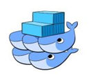

## 1. 가상화 시스템 (HyperVisior)
- 하이퍼 바이저는 호스트 컴퓨터 1대에서 다수의 운영체제를 동시에 실행할 수 있도록 해주는 가상 플랫폼 기술을 말하며 가상 머신 모니터(Virtual machine monitor)라고도 불림. 
- 여러 개의 OS가 단일 하드웨어 호스트를 공유 할 수 있도록 하는 프로그램이며 각 OS는 호스트의 프로세서, 메모리 및 기타 자원들을 모두 스스로 나타냄.
- 대표적인 시스템으로 Vmware, VirtualBox등이 있음.

### 1.1 가상화 시스템 변천사

## 2. Docker (컨테이너 가상화)
- 도커는 ‘컨테이너 기반의 오픈소스 가상화 플랫폼’
- 컨테이너란 : 애플리케이션 + 애플리케이션 구동 환경을 격리한 공간

### 2.1 컨테이너 시스템 장점
- 기민한 애플리케이션 생성 : VM에 비해 생성이 보다 간편하고 효율적
- 지속적인 개발, 통합 및 배포 : 주기적으로 컨테이너 이미지를 빌드해서 배포 가능 (이미지의 불변성) 빠르고 쉬운 롤백
- 개발과 운영의 관심사 분리 : 빌드/릴리스 시점에 애플리케이션 이미지를 제작, Infra 개념에서 디커플(분리)된다.
- 가시성 : OS 수준의 정보(Metric) + 애플리케이션의 헬스와 추가 Signal 조회 가능
- 개발, 테스팅 및 운영 환경 일관성: 로컬 or 클라우드에서 동일 구동
- 애플리케이션 중심 관리 : 가상 하드웨어의 OS에서 애플리케이션을 구동하는 수준에서 OS의 논리적인 자원을 사용하여 애플리케이션을 구동하는 수준으로 추상화 수준이 높아짐
- 느슨한 커플링, 분산, 유연, 자유로운 마이크로서비스 : 단일 목적의 애플리케이션(모놀리식) -> 작고 독립적인 단위로 쪼개져 동적 관리 및 배포
- 자원 격리: 애플리케이션 성능을 예측 가능

## 3. 컨테이너 오케스트레이션 (Orchestration) 
- 여러 컨테이너의 배포 프로세스를 최적화
- 컨테이너 자동 배포 및 복제 / 컨테이너 장애 복구 / 그룹에 대해 로드 밸런싱 / 클러스터 외부에 서비스 노출 / 컨테이너 확장 및 축소 / 컨테이너 서비스간의 인터페이스를 통한 연결 및 네트워크 포트 노출 제어
- 애플리케이션, 서비스의 자동화된 설정, 시스템 관리 조정을 의미
- Orchestration은 복잡한 Task 및 워크플로우를 보다 쉽게 관리하도록 도움

### 3.1 오케스트레이션 종류
### 3.1.1 Kubernetes

- 쿠버네티스는 컨테이너를 쉽고 빠르게 배포/확장하고 관리를 자동화해주는 오픈소스 플랫폼
- 구글에 의해 설계, 리눅스 재단에 의해 관리됨 (100% go언어로 작성)

### 3.1.2 Docker Swarm

- 여러 개의 Docker 호스트를 Clustering하여 단일 가상 Docker 호스트 생성
- 호스트 OS에 Agent만 설치하면 간단하게 작동하고 설정이 쉬움
- Docker 명령어와 Compose를 그대로 사용 가능

### 3.1.3 Apache Mesos 

- 수만 대의 물리적 시스템으로 확장 할 수 있도록 설계됨
- Hadoop, MPI, Hypertable, Spark 등의 응용 프로그램을 동적 클러스터 환경에서 리소스 공유/분리를 통해 자원 최적화 가능
- Docker 컨테이너를 적극 지원

### 3.1.4 Amazone ECS

- Amazon Elastic Container Service(ECS)는 클라우드 서비스로 제공되는 오케스트레이션 시스템
- Amazon ECS를 사용시 자체 컨테이너 오케스트레이션 SW를 설치하고 운영할 필요 X

### 3.2 Orchestraion 도구 차이점 요약
- 오케스트레이션 도구별 설정 방법과 동작방식이 상당히 다름
- Docker Swam : Docker 호스트 클러스터를 조정하기 가장 쉬운 방법을 제공
- Kubernetes : 컨테이너 서비스 배포 및 관리에 많은 이점을 가짐
- Apache Mesos : 대규모 클러스터링을 지원 (특히, Hadoop, Kafka 및 Spark와 같은 다른 서비스와 함께 응용 프로그램을 배치가 필요한 환경에 적합)
- Amazon ECS : 클라우드 서비스로 제공되며, 오케스트레이션 시스템 구축을 위한 특별한 소요 x