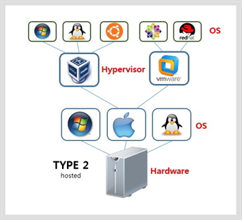
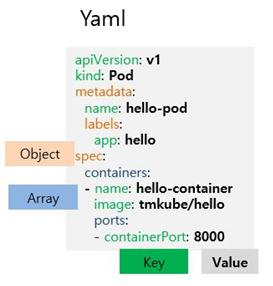
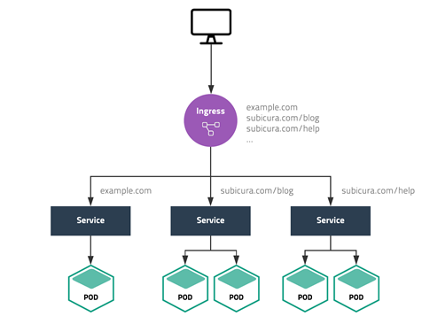
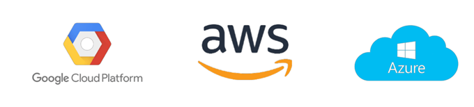

## ▶ HyperVisior 란
- 하이퍼 바이저는 호스트 컴퓨터 1대에서 다수의 운영체제를 동시에 실행할 수 있도록 해주는 가상 플랫폼 기술을 말하며 가상 머신 모니터(Virtual machine monitor)라고도 불림. 
- 여러 개의 OS가 단일 하드웨어 호스트를 공유 할 수 있도록 하는 프로그램이며 각 OS는 호스트의 프로세서, 메모리 및 기타 자원들을 모두 스스로 나타냄.
- 대표적인 시스템으로 Vmware, VirtualBox등이 있음.

## ▶ 가상화 시스템 변천사

## ▶ Docker 란
- 도커는 ‘컨테이너 기반의 오픈소스 가상화 플랫폼’
- 컨테이너란 : 애플리케이션과 애플리케이션을 구동화는 환경을 격리한 공간

## ▶ 컨테이너 시스템 장점
- 기민한 애플리케이션 생성과 배포: VM 이미지를 사용하는 것에 비해 컨테이너 이미지 생성이 보다 쉽고 효율적임.
- 지속적인 개발, 통합 및 배포: 안정적이고 주기적으로 컨테이너 이미지를 빌드해서 배포할 수 있고 (이미지의 불변성 덕에) 빠르고 쉽게 롤백할 수 있다.
- 개발과 운영의 관심사 분리: 배포 시점이 아닌 빌드/릴리스 시점에 애플리케이션 컨테이너 이미지를 만들기 때문에, 애플리케이션이 인프라스트럭처에서 디커플(분리)된다.
- 가시성은 OS 수준의 정보와 메트릭에 머무르지 않고, 애플리케이션의 헬스와 그 밖의 시그널을 볼 수 있다.
- 개발, 테스팅 및 운영 환경에 걸친 일관성: 랩탑에서도 클라우드에서와 동일하게 구동된다.
- 클라우드 및 OS 배포판 간 이식성: Ubuntu, RHEL, CoreOS, on-prem, Google Kubernetes Engine 및 다른 어디에서든 구동된다.
- 애플리케이션 중심 관리: 가상 하드웨어의 OS에서 애플리케이션을 구동하는 수준에서 OS의 논리적인 자원을 사용하여 애플리케이션을 구동하는 수준으로 추상화 수준이 높아진다.
- 느슨하게 커플되고, 분산되고, 유연하며, 자유로운 마이크로서비스: 애플리케이션은 단일 목적의 머신에서 모놀리식 스택으로 구동되지 않고 보다 작고 독립적인 단위로 쪼개져서 동적으로 배포되고 관리될 수 있다.
- 자원 격리: 애플리케이션 성능을 예측할 수 있다.
- 자원 사용량: 고효율 고집적.

## ▶ 컨테이너 오케스트레이션 (orchestration) 
- 여러 컨테이너의 배포 프로세스를 최적화 (컨테이너와 호스트의 수가 증가함에 따라 가치도 높아짐)
- 컨테이너를 자동 배포 및 복제 / 컨테이너 장애 복구 / 그룹에 대한 로드 밸런싱 / 클러스터 외부에 서비스 노출 / 컨테이너 확장 및 축소 / 컨테이너 서비스간의 인터페이스를 통한 연결 및 네트워크 포트 노출 제어
- 컴퓨터 시스템과 애플리케이션, 서비스의 자동화된 설정, 관리 조정을 의미
- 오케스트레이션은 IT팀이 복잡한 테스크와 워크플로우를 보다 쉽게 관리할 수 있도록 도움.

## ▶ 오케스트레이션 종류
### (1) Kubernetes

  - 쿠버네티스는 컨테이너를 쉽고빠르게 배포/확장하고 관리를 자동화해주는 오픈소스플랫폼
  - 구글에 의해 설계되고 리눅스 재단에 의해 관리됨 기능이 풍부하여 널리 사용되는 오케스트레이션 프레임워크 (100% go언어로 작성)
  - 목적 : 여러 클러스터의 호스트 간에 어플리케이션 컨테이너의 배치, 스케일링, 운영을 자동화하기 위한 플랫폼 제공
  - 베어 메탈, VM환경, 퍼블릿 클라우드 등의 다양한 환경에서 작동하도록 설계됨
  - 컨테이너의 롤링 업그레이드 지원
  - 클라우드 네이티브 애플리케이션 대부분이 쿠버네티스와 찰떡궁합
      - ==> 뒤 하단에서 Kubernetes 구체적 설명

### (2) Docker Swarm

  - 여러 개의 Docker 호스트를 함께 클러스터링하여 단일 가상 Docker 호스트 생성
  - 호스트 OS에 Agent만 설치하면 간단하게 작동하고 설정이 쉬움
  - Docker 명령어와 Compose를 그대로 사용 가능
  
### (3) Apache Mesos 

- 수만 대의 물리적 시스템으로 확장 할 수 있도록 설계됨
- Hadoop, MPI, Hypertable, Spark와 같은 응용 프로그램을 동적 클러스터 환경에서 리소스 공유와 분리를 통해 자원 최적화 가능
- Docker 컨테이너를 적극 지원

### (4) Amazone ECS

- Amazon Elastic Container Service(ECS)는 클라우드 서비스로 제공되며 오케스트레이션 시스템 구축을 위한 특별한 준비 없이 사용 가능
- Docker 컨테이너 지원하나 도커의 모든 기능을 사용하기에는 약간 제약이 있고, 세세한 컨트롤이 어렵다. 
- 2015년 릴리즈 이후 서비스 스케일링, 태스크 기반 IAM 지원, 애플리케이션 로드밸런서 지원, 서비스 디스커버리, AWS배치릴리즈, 파게이트(Fargate)지원 등 활용성은 상당히 높은 편
- Amazon ECS를 사용하면 자체 컨테이너 오케스트레이션 소프트웨어를 설치하고 운영할 필요가 없으며, 가상 머신의 클러스터를 관리 및 확장하거나 해당 가상 머신에서 컨테이너를 예약하지 않아도 됩니다.

### (5) 기타 정보
- 위 오케스트레이션 도구는 설정방법과 동작방식이 상당히 다름.
- Docker Swam은 Docker 호스트 클러스터를 조정하기 가장 쉬운 방법을 제공하고 있고
- Kubernetes는 컨테이너 서비스 배포 및 관리에 많은 이점을 가지고 있음
- Apache Mesos는 대규모 클러스터링을 지원하고 특히 Hadoop, Kafka 및 Spark와 같은 다른 서비스와 함께 응용 프로그램을 배치해야 하는 환경에 특히 적합함
- Amazon ECS는 클라우드 서비스로 제공되며 오케스트레이션 시스템 구축을 위한 특별한 준비 없이 사용가능

## ▶ ELK 란 + beats

### ■ ElasticSearch : ElaticSearch 는 Lucene 기반으로 개발한 검색 및 분산 검색엔진으로, LogStash 를 통해 수신된 데이터를 저장소에 저장하는 역할을 담당

### ■ LogStash : 수집할 로그를 선정해서,  지정된 대상 서버(Elasticsearch)에 인덱싱해서 전송하는 역할을 담당하는 소프트웨어 (다양한 플러그인 제공을 여러 유형의 로그 수집 및 인덱싱이 가능함)

### ■ Kibana : 사용자에게 무언가를 보여주기 위한 목적, <b>Visualization</b> 을 담당하는 HTML + Javascript 엔진이라고 보면 됨
- Kibana를 사용하면 Elasticsearch에서 차트와 그래프로 데이터를 시각화 할 수 있습니다

### ■ Beat

- 단일 목적의 데이터 수집기 플랫폼인 Beats는 수백 수천 개의 장비와 시스템으로부터 Logstash나 Elasticsearch에 데이터를 전송

- 1. 1개 이상의 Client( 수집할 Data 발생 서버 )에서 beats가 특정 트리거에 의해 logstash로 Data를 전송합니다. (각 Client마다 Beats 존재)

- 2. logstash로 전달 된 Data를 커스터마이징이 가능한 필터를 통해 가공하여 Elasticsearch로 전달 합니다.

- 3, Elasticsearch로 전달 받은 데이터를 서버(Elasticsearch)에 저장합니다.

- 4. kibana에서 연동되있는 Elasticsearch에 저장된 데이터 셋을 토대로 시각화를 제공 합니다.

## ▶ Kubeflow 란
- Kubernetes 환경에서 간단하게 머신 러닝 워크플로우를 배포할 수 있게 도와주는 시스템
- Kubeflow의 목적 : 다양한 환경에서 실행하는 머신러닝 워크플로우를 단일 환경에서 손쉽고 직관적으로 배포하게 하는 것 
- Kubeflow의 주요 기능

### (1) Ksonnet (서비스 배포 및 관리, YAML)
- Kubeflow는 Ksonnet을 이용해서 서비스를 배포하면 Ksonnet은 kubectl위에서 작동하며 Kubernetes 환경으로의 배포를 추상화하여 여러 환경으로 배포할 수 있도록 함
- Kubernetes가 배포 정보를 정적인 yaml 파일로 관리하며 Ksonnet은 프로토타입과 컴포넌트를 이용해서 이 yaml 파일을 동적으로 생성
- 프로토 타입은 Kubernetes에 배포될 자원 명세로 설정 가능한 파라메터를 제외한 형식
- 컴포넌트는 프로토 타입에 파라메터를 주입한 구현체로 이를 이용해서 다양한 yaml 파일을 생성해서 다양한 환경에 배포가 가능.

### (2) Tensorflow Training Controller (트레이닝 관리)
- Kubeflow에서 Tensorflow 트레이닝 잡을 돌리는 기능으로 TFJob으로 정의함.
- TFJob은 kubernets의 custom resource로 만들어져 있으며 YAML 파일로 정의해서 실행시키며 Distributed Tensorflow의 형태로 배포됨.

### (3) Tensorflow Serving (웹에다 나타내주는 Dashboard? 것인 듯)
- Kubeflow를 이용해서 Tensorflow Serving을 하기 위해서는 먼저 Http-proxy 컨테이너를 배포해야함.
- 또한 사용할 수 있는 모델은 Google Cloud, Amazon S3, NFS에서 가져올 수 있도록 지원.
- GPU 설정과 같은 파라메타 설정을 한 후 앱을 배포시 설정한 URL로 텐서플로우 모델을 서빙가능

### (4) Jupyter Notebooks
- Kubeflow 설치시 Kubeflow Dashboard가 생성됨
- Dashboard에서는 텐서플로우 Job / 현재 Kubeflow의 상황 등을 모니터링 가능
- Jupyter Hub가 제공되어 적절한 크기의 컨테이너를 할당받은 Jupyter Notebook 도 사용가능

## ▶ YAML 이란
- xml과 JSON 과 유사한 것으로 타 시스템 간에 데이터를 주고받을 때 데이터 포맷에 대한 약속이 필요한데 그중 하나가 yaml
- 야믈이라고 읽고, yml 이라고도 쓰며 / xml jaon 보다 가독성이 뛰어남. / yaml 써보면 다른놈들 ㄴㄴ

- 쿠버네티스에서 API를 전송시 Json 규격도 사용되지만 일반적으로 yaml을 권장함

## ▶ IAM 이란
- Identity and Access Manager. 의 약자. AWS의 모든 솔루션의 서비스 및 자원에 대해 개별적으로 권한을 부여할 수 있는 권한 관리

## ▶ 쿠버네티스 배포 방식
- 쿠버네티스는 Deployment, StatefulSets, DaemonSet, Job, CronJob등 다양한 배포 방식을 지원합니다. Deployment는 새로운 버전의 애플리케이션을 다양한 전략으로 무중단 배포할 수 있습니다. 
- StatefulSets은 실행 순서를 보장하고 호스트 이름과 볼륨을 일정하게 사용할 수 있어 순서나 데이터가 중요한 경우에 사용할 수 있습니다. 
- 로그나 모니터링 등 모든 노드에 설치가 필요한 경우엔 DaemonSet을 이용하고 
- 배치성 작업은 Job이나 CronJob을 이용하면 됩니다.

## ▶ 쿠버네티스 Ingress 설정

- 다양한 웹 애플리케이션을 하나의 로드 밸런서로 서비스하기 위해 Ingress입장기능을 제공

- 웹 애플리케이션을 배포하는 과정을 보면 외부에서 직접 접근할 수 없도록 애플리케이션을 내부망에 설치하고 외부에서 접근이 가능한 ALB나 Nginx, Apache를 프록시 서버로 활용하는게 일반적.
- 프록시 서버는 도메인과 Path 조건에 따라 등록된 서버로 요청을 전달하는데 서버가 바뀌거나 IP가 변경되면 매번 설정을 수정해줘야 합니다. 
- 쿠버네티스의 Ingress는 이를 자동화하면서 기존 프록시 서버에서 사용하는 설정을 거의 그대로 사용할 수 있습니다. - 새로운 도메인을 추가하거나 업로드 용량을 제한하기 위해 일일이 프록시 서버에 접속하여 설정할 필요가 없습니다.
- 하나의 클러스터에 여러 개의 Ingress 설정을 할 수 있어 관리자 접속용 Ingress와 일반 접속용 Ingress를 따로 관리할 수 있습니다.

### * 로드밸런싱이란
부하분산 또는 로드 밸런싱은 컴퓨터 네트워크 기술의 일종으로 둘 혹은 셋이상의 중앙처리장치 혹은 저장장치와 같은 컴퓨터 자원들에게 작업을 나누는 것을 의미한다. 이로써 가용성 및 응답시간을 최적화 시킬 수 있다.

### ▶ 쿠버네틱스 클라우드 지원

- 쿠버네티스는 부하에 따라 자동으로 서버를 늘리는 기능으로 AutoScaling이 있고 IP를 할당받아 로드밸런스LoadBalancer로 사용할 수 있다
- 외부 스토리지를 컨테이너 내부 디렉토리에 마운트하여 사용하는 것도 일반적인데 이를 위해 클라우드 별로 적절한 API를 사용하는 모듈이 필요.
- 쿠버네티스는 Cloud Controller를 이용하여 클라우드 연동을 손쉽게 확장할 수 있습니다. AWS, 구글 클라우드, 마이크로소프트 애저는 물론 수십 개의 클라우드 업체에서 모듈을 제공하여 관리자는 동일한 설정 파일을 서로 다른 클라우드에서 동일하게 사용할 수 있습니다.

